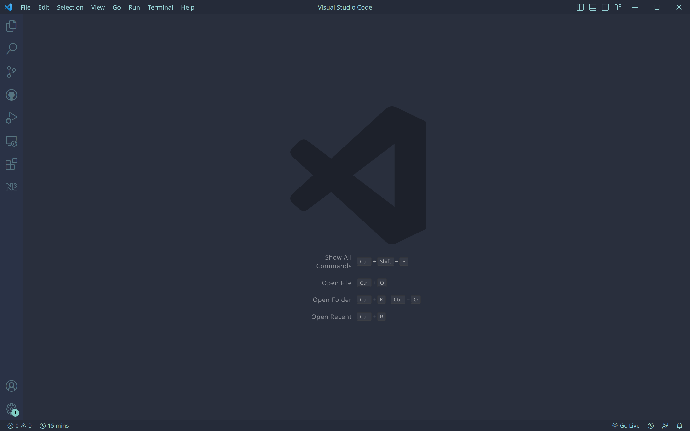
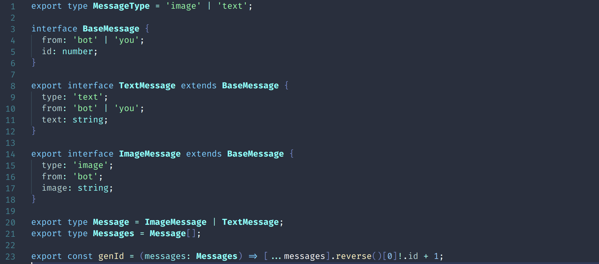
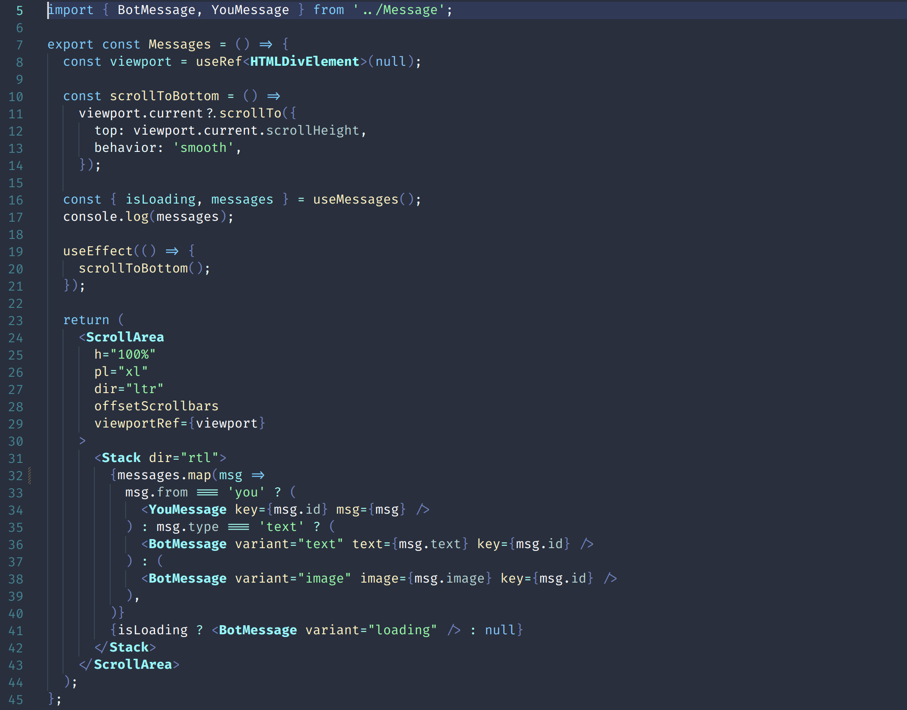
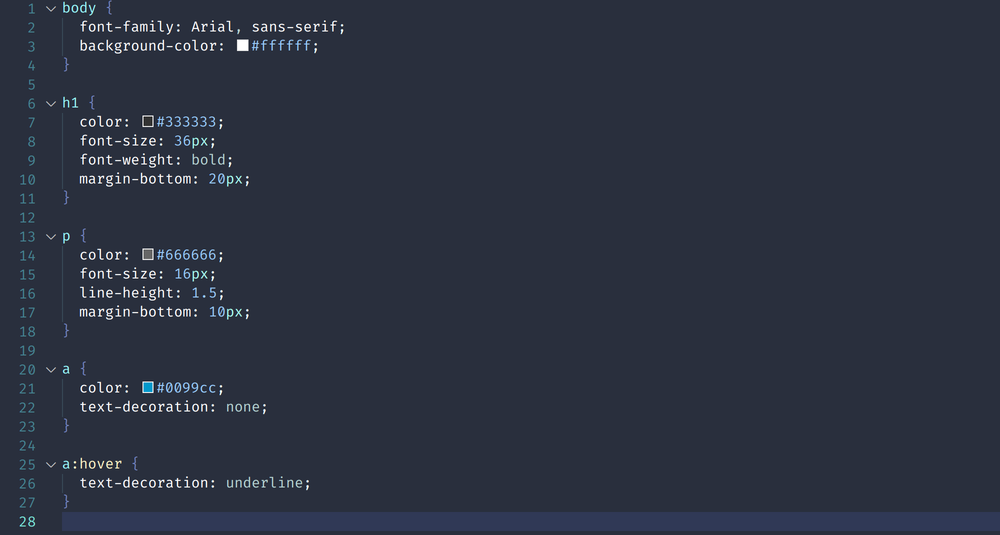
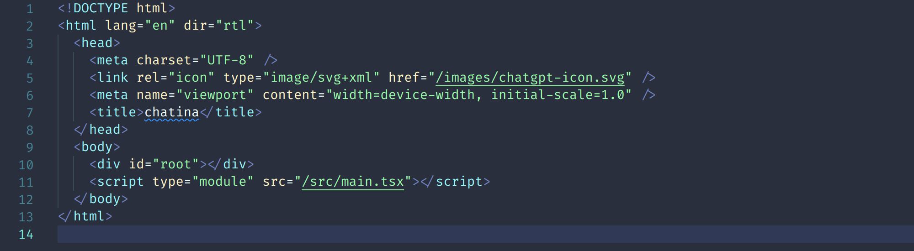
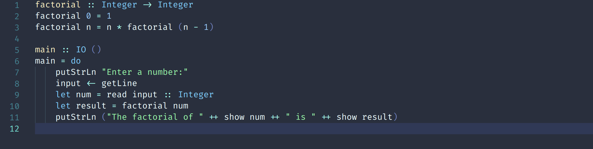
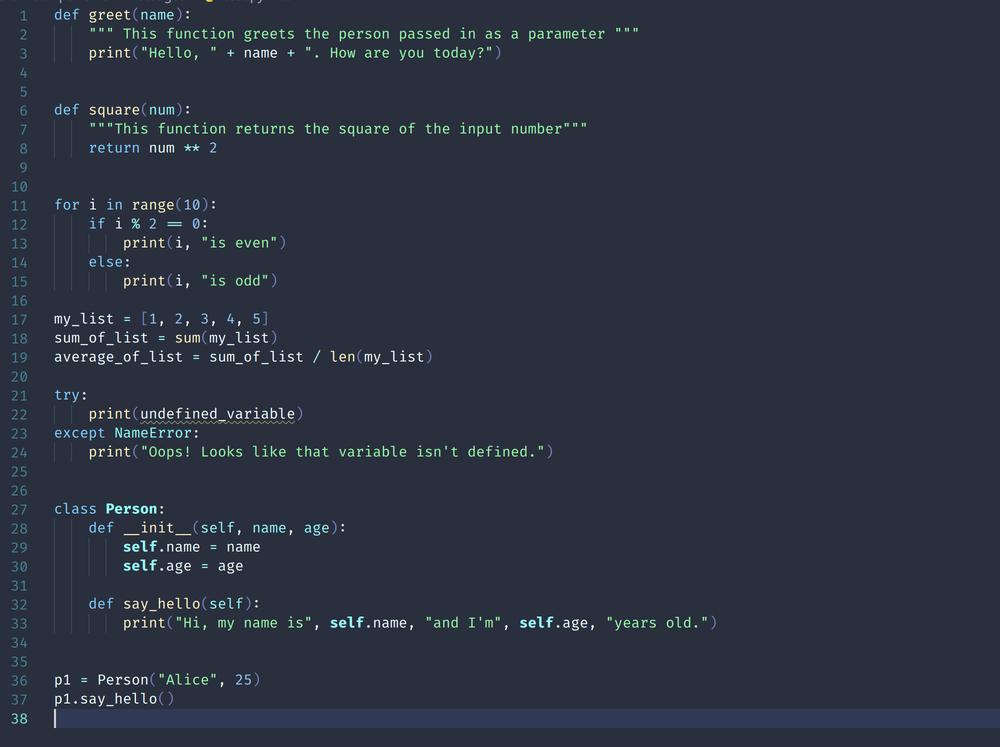
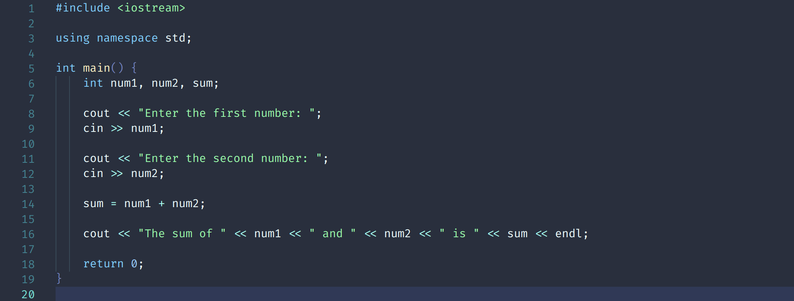

# Installation

you can install this theme by writing this in your command palette (`Ctrl+P`)

    ext install Amirabbas.blue-forest

# Screenshots

## Main Page:

## Typescript:

## TSX:

## CSS:

## HTML:

## Haskell:

## Python:

## C++:

# In Progress

- waiting for some reviews about the new look :))
