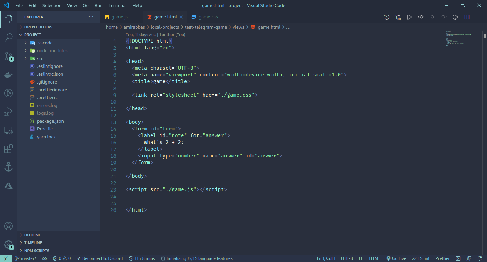
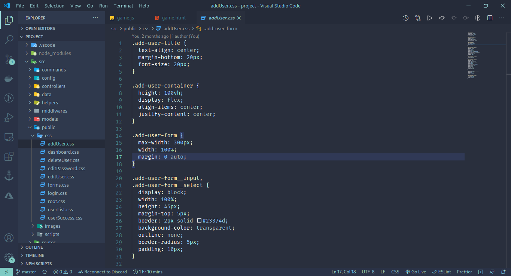
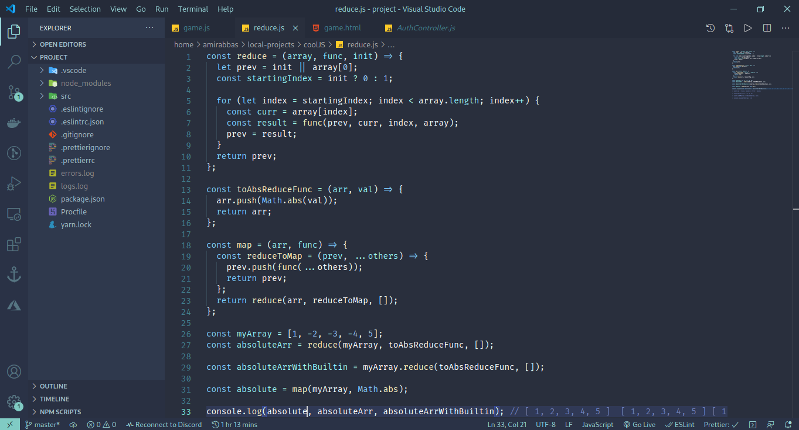
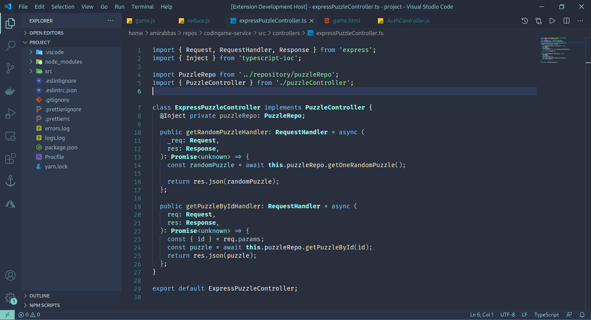
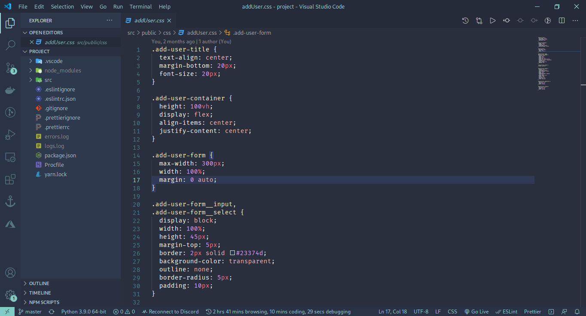
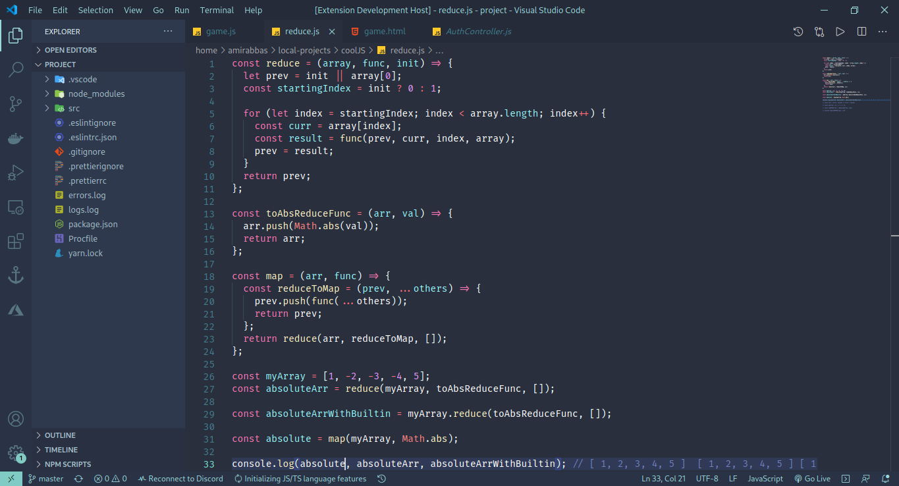
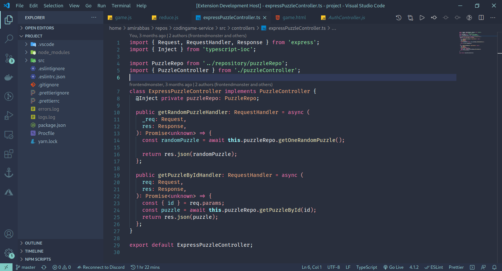

# Installation

you can install this theme by writing this in your command palette (`Ctrl+P`)

    ext install Amirabbas.blue-forest

# Screenshots

## blue forest

## blue&red forest

# In Progress

- waiting for some reviews about the new look :))
